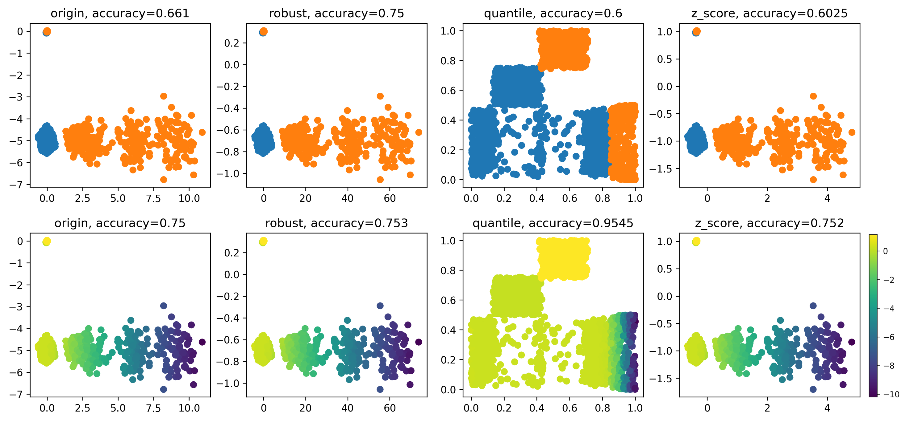

# NormEnhancer

## Time series deep models.
GRU: Unlike traditional RNNs, GRU incorporates gating mechanisms that enable it to selectively update and reset its memory cells.  
TCN: A typical temporal convolutional network.   
Autoformer: A variant of Transformers with a decomposition forecasting architecture.   
LightTS: A light deep learning architecture merely based on simple MLP-based structures.   
SCINet:  SCINet downsamples the time series and uses convolutional filters to extract features and interact information.   
DLinear:  DLinear is a combination of a Decomposition scheme used in Autoformer and FEDformer with linear layers.   
ResNet: ResNet-like architecture used for time series data.     
InceptionTime: InceptionTime is a deep learning model designed for time series data, leveraging a combination of the Inception architecture developed by Google. It incorporates elements from both Convolutional Neural Networks (CNNs) and Residual Networks (ResNets) to tackle various time series prediction tasks.   
OS-CNN: Unlike conventional Convolutional Neural Networks (CNNs), OS-CNN is designed to process skeletal joint information, making it highly effective for understanding human actions from temporal sequences of skeletal data.   

## Tabular deep models.  
MLP:  
ResNet:  The key innovation is the use of residual connections, also known as skip connections or shortcut connections. These connections enable the network to effectively train very deep neural networks, which was challenging before due to the vanishing gradient problem.    
TabNet:  A recurrent architecture that alternates dynamical reweighing of features and conventional feed-forward modules.   
AutoInt:  Transforms features to embeddings and applies a series of
attention-based transformations to the embeddings.   
FTTransformer:  FT-Transformer is introduced by ~\citep{gorishniy2021revisiting} to further improved AutoInt through better token embeddings.  

## Time series data properties.
| Dataset| ETTh1 [link](https://github.com/zhouhaoyi/ETDataset)| ETTh2 [link](https://github.com/zhouhaoyi/ETDataset) | ETTm1 [link](https://github.com/zhouhaoyi/ETDataset) | ETTm2 [link](https://github.com/zhouhaoyi/ETDataset) | Exchange [link](https://drive.google.com/drive/folders/1ZOYpTUa82_jCcxIdTmyr0LXQfvaM9vIy) | WTH [link](https://drive.google.com/drive/folders/1ohGYWWohJlOlb2gsGTeEq3Wii2egnEPR) | ECL [link](https://drive.google.com/drive/folders/1ohGYWWohJlOlb2gsGTeEq3Wii2egnEPR)  | Traffic [link](https://drive.google.com/drive/folders/1ZOYpTUa82_jCcxIdTmyr0LXQfvaM9vIy) | FA [link](https://www.timeseriesclassification.com/Downloads/Archives/Multivariate2018_arff.zip) | PE [link](https://www.timeseriesclassification.com/Downloads/Archives/Multivariate2018_arff.zip)  | HA [link](https://www.timeseriesclassification.com/Downloads/Archives/Multivariate2018_arff.zip) | PH [link](https://www.timeseriesclassification.com/Downloads/Archives/Multivariate2018_arff.zip)  | IN [link](https://www.timeseriesclassification.com/Downloads/Archives/Multivariate2018_arff.zip) |
| ------ | ----- | ----- | ----- | ------| -------  | ---  | -----| -------  | --  | --  | --  | ---  | --  | 
|sequence| 17420 | 17420 | 69680 | 69680 | 7588     | 35064| 26304| 17544    | 9414| 440 | 1000| 6668 | 50000|
|timesteps | -     | -     | -     | -     | -        | -     | -     | -        | 62   | 144  | 152  | 217  | 22 |
|channels  | 7     | 7     | 7     | 7     | 8        | 12    | 321   | 862      | 144  | 963  | 3    | 11   | 200|
|classes   | -     | -     | -     | -     | -        | -     | -     | -        | 2    | 7    | 26   | 39   | 10 |   
|metric    | MSE   | MSE   | MSE   | MSE   | MSE      | MSE   | MSE   | MSE      | AUC  | MAUC | MAUC | MAUC | MAUC|

## Tabular data properties. All the tabular data can be down load at [link](https://www.dropbox.com/s/dl/o53umyg6mn3zhxy/data.tar.gz).
|Dataset| YE     | MI  | YA     | CA    | AD    | HI    | EP     | HE    | CO     | JA   |
|------ |------ |------ |------ |------ |------ |------ |------ |------ |------ |------ |
|objects| 515345 | 1200192 | 709877 | 20640 | 48842 | 98050 | 500000 | 65196 | 581012 | 83733 |
|num_features | 90     | 136     |699    | 8    | 6     |28    | 2000   | 27    | 54     | 54    |
|cat_features | 0      |0        | 0     | 0    | 8     | 0    | 0      | 0     | 0      | 0     |
|classes      | -      | -       | -     | -    | 2     | 2    | 2      | 100   | 7      | 4     |
| metric      | MSE    | MSE     | MSE   | MSE   | AUC  | AUC  | AUC    | MAUC  | MAUC   | MAUC  |

## NormEnhancer's performance

